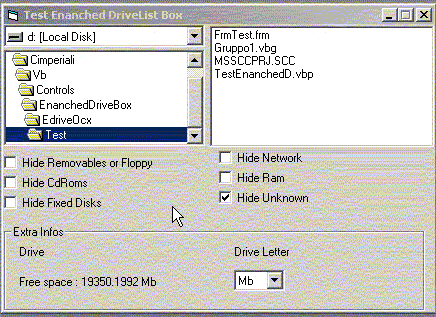



## Enanched Drive List Box

### Description

Ocx with ImageCombo and ListImages

A fellow asked for a Drive list Box control that could show/hide some type of disks (ie: removable,CdRom...) I built this for him. May be someone else could find it useful
 
### More Info
 

             |
---                |---
**Submitted On**   |2003-12-18 06:09:02
**By**             |[Cesare Imperiali](https://github.com/Planet-Source-Code/PSCIndex/blob/master/ByAuthor/cesare-imperiali.md)
**Level**          |Intermediate
**User Rating**    |4.2 (21 globes from 5 users)
**Compatibility**  |VB 6\.0
**Category**       |[OLE/ COM/ DCOM/ Active\-X](https://github.com/Planet-Source-Code/PSCIndex/blob/master/ByCategory/ole-com-dcom-active-x__1-29.md)
**World**          |[Visual Basic](https://github.com/Planet-Source-Code/PSCIndex/blob/master/ByWorld/visual-basic.md)
**Archive File**   |[Enanched\_D16848512182003\.zip](https://github.com/Planet-Source-Code/cesare-imperiali-enanched-drive-list-box__1-50506/archive/master.zip)

### API Declarations

Uses api: GetLogicalDrives, GetDriveType, GetVolumeInformation, GetDiskFreeSpaceEx.

